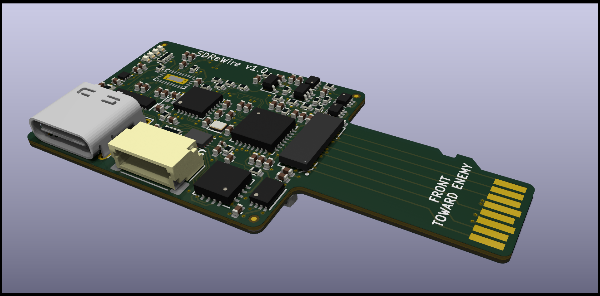

# SDReWire

Modern SD card muxer - allows to mux a SD card between an on-board USB SD card
reader and the device SDReWire is plugged into. This is useful for developing
and testing (embedded) systems which often require SD cards to boot from. It
allows to access the SD card on the target system as well as from the host
system connected via USB without having to touch the SD card.
 
Inspiried by the SDWire.

## Features

- USB-C connector for host system
- High speed signal muxer to mux SD signals
- SDXC/UHS capable design
- USB 3.1 Gen1 card reader (90MB/s+)
- FTDI for SD muxing and auxiliary port
- Auxiliary port featuring:
  - UART
  - 2 GPIO (1x output only)
  - 1.2V/1.8V/3.3V capable

Currenlty SDReWire is still in testing and development phase.

### Details

In case you wonder what exact components are used, here is the gist:

- USB 3.1 Gen1 card reader [Genesys Logic GL3224](https://www.genesyslogic.com.tw/en/product_view.php?show=53)
- [TS3DDR4000ZBAR](https://www.ti.com/product/TS3DDR4000/part-details/TS3DDR4000ZBAR) mux IC used for SD signals
- [FTDI FT230XQ](https://www.mouser.in/datasheet/2/163/DS_FT230X-5395.pdf) provides GPIO for mux as well as auxiliary UART and GPIO
- [USB2422 USB 2.0 Hub](https://www.microchip.com/en-us/product/USB2422) to interface GL3224 and FTDI FT230XQ
  
Designed with KiCad.

## License

Licensed under the CERN-OHL-W (CERN Open Hardware Licence Version 2 - Weakly
Reciprocal, see LICENSE).
